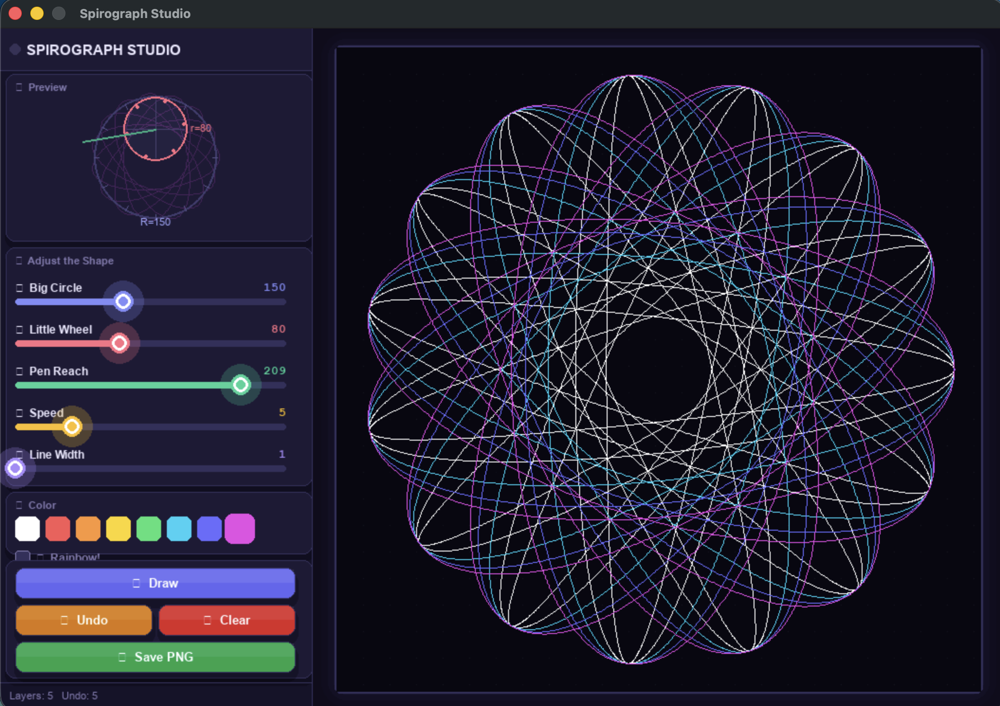
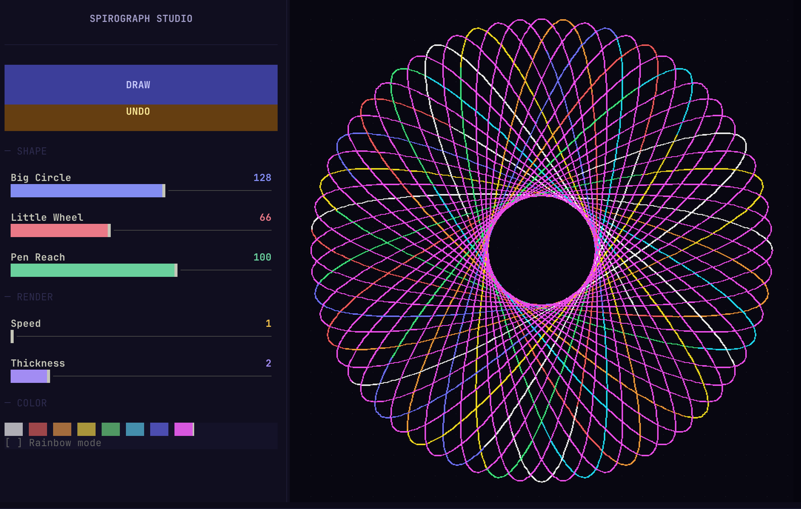

# Spirograph Studio

An interactive spirograph art app built with Python. Roll a small wheel inside a large ring, adjust the pen offset, and watch intricate geometric patterns emerge — just like the classic toy.

Runs in two modes: a **Pygame desktop app** and a **terminal TUI** (via Textual + Kitty Graphics Protocol).

---

## Pygame Desktop App



### Quick Start

```bash
# Requires Python 3.13 (pygame has no wheel for 3.14+)
python3.13 -m venv .venv
source .venv/bin/activate
pip install pygame pillow textual textual-image
python spirograph.py
```

### Controls

| Control | What it does |
|---------|-------------|
| **Big Circle** slider | Outer ring radius (R) |
| **Little Wheel** slider | Inner rolling wheel radius (r) |
| **Pen Reach** slider | Pen offset from wheel center (d) |
| **Speed** slider | Drawing speed (segments per frame) |
| **Line Width** slider | Stroke thickness |
| **Color swatches** | Pick a solid pen color |
| **Rainbow checkbox** | Cycle through the full color spectrum |
| **Draw** button | Compute and animate the current curve |
| **Undo** button | Remove the last drawn layer |
| **Clear** button | Wipe the canvas (undoable) |
| **Save PNG** button | Save canvas to `~/Desktop/spirograph/` |
| `Cmd/Ctrl+Z` | Keyboard undo |
| `Esc` | Quit |

---

## Terminal TUI

> Requires a Kitty/TGP-compatible terminal (Ghostty, Kitty, WezTerm).



### Quick Start

```bash
source .venv/bin/activate
./spirograph_tui.py
```

### Controls

| Control | What it does |
|---------|-------------|
| **Big Circle** slider | Outer ring radius (R) |
| **Little Wheel** slider | Inner rolling wheel radius (r) |
| **Pen Reach** slider | Pen offset from wheel center (d) |
| **Speed** slider | Drawing speed |
| **Thickness** slider | Stroke width |
| **Color swatches** | Click or `←` `→` to pick a color |
| `r` | Toggle rainbow mode |
| **DRAW** button | Draw the current curve (or press `d`) |
| **UNDO** button | Remove the last layer |
| **CLEAR** button | Wipe the canvas (undoable) |
| **SAVE** button | Save canvas PNG to `~/Desktop/spirograph/` |
| `Ctrl+Z` | Keyboard undo |
| `Esc` / `q` | Quit |

---

## Math

Spirographs trace a [hypotrochoid](https://en.wikipedia.org/wiki/Hypotrochoid) — the path of a point attached to a smaller circle rolling inside a larger one:

```
x(t) = (R - r) * cos(t) + d * cos((R - r) * t / r)
y(t) = (R - r) * sin(t) - d * sin((R - r) * t / r)
```

The curve closes after `r / gcd(R, r)` full rotations of the inner wheel.

---

## Project Structure

```
spirograph/
├── spirograph.py           # Pygame entry point
├── spirograph_tui.py       # TUI entry point
├── constants.py            # Shared layout geometry
├── theme.py                # Shared visual stylesheet
├── spiro_math.py           # Shared hypotrochoid math
│
├── pygame_app/             # Pygame desktop app
│   ├── app.py
│   ├── drawing_engine.py
│   ├── preview.py
│   ├── renderer.py
│   ├── ui_layout.py
│   ├── utils.py
│   └── widgets/
│       ├── slider.py
│       ├── button.py
│       └── color_picker.py
│
├── tui/                    # Terminal TUI app
│   ├── app.py
│   ├── drawing_engine.py
│   ├── theme.tcss
│   └── widgets/
│       ├── canvas.py
│       ├── slider.py
│       ├── color_picker.py
│       └── preview.py
│
└── assets/
    ├── pygame.png
    └── tui.png
```

## Requirements

- Python 3.13+
- `pygame` — desktop app
- `pillow`, `textual`, `textual-image` — terminal TUI
